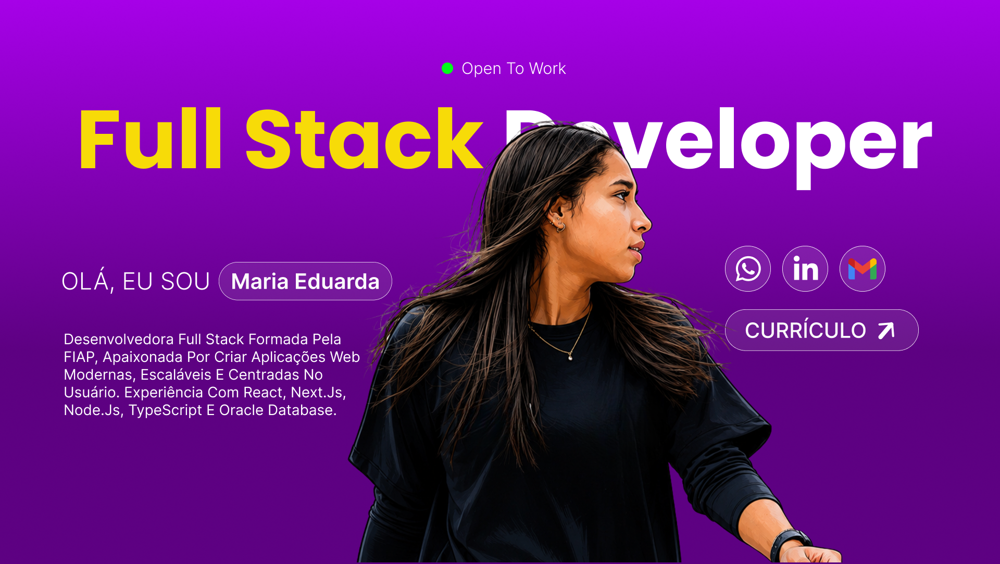

# 💜 Meu Portfólio

<p align="center">
  
</p>

<p align="center">
  <a href="https://portfolio-dudafernandes.vercel.app/" target="_blank">
    🌐 Acessar Portfólio
  </a>
</p>

---

## Sobre

Este repositório contém o código-fonte do meu portfólio pessoal, desenvolvido para apresentar minha trajetória, projetos, certificações e habilidades como Desenvolvedora Full Stack.

O objetivo foi criar uma interface moderna, responsiva e com foco em experiência do usuário.

---

## Funcionalidades

- Hero responsiva
- Seção Sobre Mim
- Carrossel de Projetos
- Links para projetos e GitHub
- Carrossel de Certificados
- Carrossel automático de tecnologias
- Seção de Contato
- Download do currículo
- Layout totalmente responsivo

---

## Tecnologias

- HTML5
- CSS3
- JavaScript
- Git
- GitHub
- Vercel

---

## Estrutura

```text
📦 meu-portfolio
 ┣ 📂 assets
 ┃ ┣ 📂 certificates
 ┃ ┣ 📂 icons
 ┃ ┗ 📂 images
 ┣ 📜 index.html
 ┣ 📜 style.css
 ┣ 📜 script.js
 ┗ 📜 README.md
```

---

## Deploy

O projeto está publicado na Vercel.

🔗 **Portfólio Online**

https://portfolio-dudafernandes.vercel.app/

---

## Preview

<p align="center">
  
</p>

---

## Autor

### Maria Eduarda Fernandes Rocha

Desenvolvedora Full Stack

- 💼 LinkedIn: [https://linkedin.com/in/mariaeduardafernandes](https://www.linkedin.com/in/dudafernanndes/)
- 💻 GitHub: [https://github.com/dudafernandes](https://github.com/dudafernanndes)
- 📧 E-mail: dev.dudafernandes@gmail.com

---

⭐ Se gostou do projeto, deixe uma estrela no repositório!